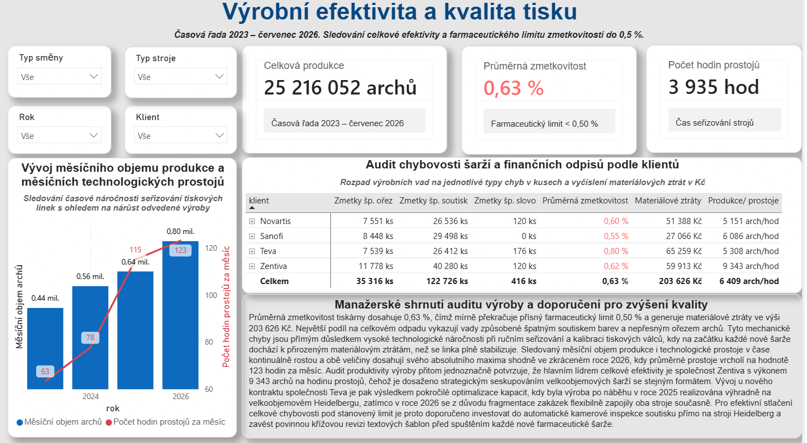
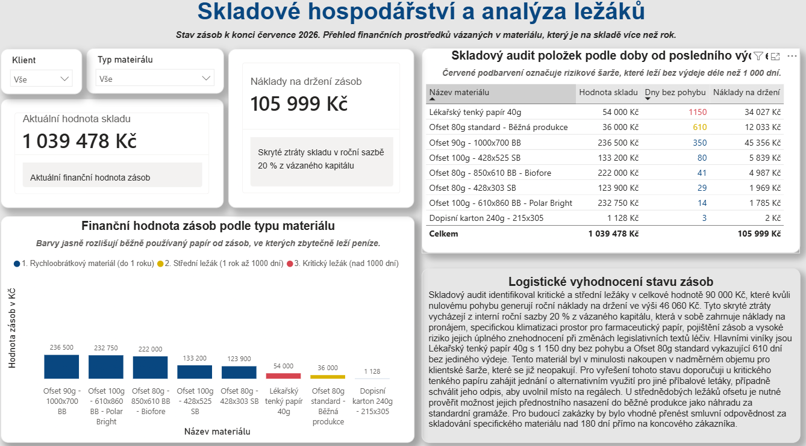
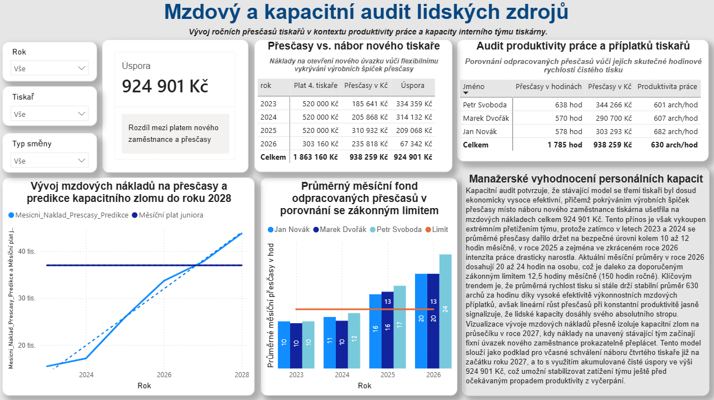
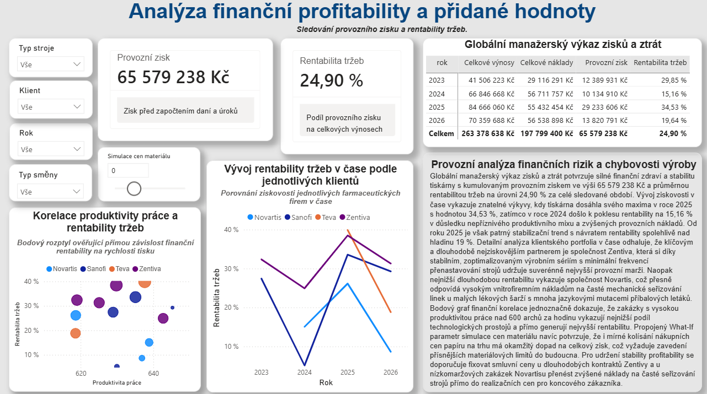

# End-to-End analytika farmaceutické tiskárny
### Propojení výrobních ukazatelů s finančním řízením

## Příběh dat: Když kapacita naráží na technologický strop
Tento projekt je komplexní případovou studií z prostředí polygrafického provozu specializovaného na tisk příbalových letáků pro nadnárodní farmaceutické lídry (**Zentiva, Sanofi, Novartis, Teva**). Prezentovaná data, názvy entit i finanční výsledky jsou naprosto smyšlené a slouží výhradně pro účely této ukázky. 

Celá architektura, datový model i byznysová logika však stoprocentně vycházejí z mé **9leté reálné praxe na pozici datové analytičky v reálné tiskárně farmaceutických příbalových letáků**. Projekt tak nepředstavuje generická data stažená z internetu, ale věrně simuluje skutečné zákonitosti, technologické limity, chybovost a finanční procesy v polygrafickém průmyslu.

Cílem projektu bylo vyřešit klasický manažerský konflikt: **Jak dlouho lze financovat výrobní špičky a růst zakázek pouze přesčasy stávajícího týmu, než unavený provoz zkolabuje na chybovosti, prostojích a sankcích za pozdní dodání?**

Pomocí datového inženýrství v MySQL a pokročilého modelování v Power BI projekt odkrývá skrytá provozní rizika, finančně vyčísluje náklady na držení skladových ležáků a dává top managementu do rukou predikční modely a What-If simulace pro strategická rozhodnutí v reálném čase.

### Klíčové finanční ukazatele za období 2023 – 07/2026
*   **Hrubý objem produkce:** Výrobní linky za toto období zpracovaly celkem **25,2 milionu archů**, což reflektuje strmě rostoucí tržní poptávku.
*   **Akumulovaný provozní zisk:** Efektivní řízení kapacit vygenerovalo za necelé čtyři roky provozní zisk ve výši **65,5 milionu Kč**.
*   **Rentabilita tržeb:** Průměrná ziskovost provozu si drží zdravou hladinu **24,90 %**.
*   **Disponibilní kapitál:** Identifikací kritických ležáků a optimalizací mzdových struktur byl izolován finanční polštář v hodnotě **924 901 Kč** připravený pro strategický rozvoj.

<video src="tiskárna_Leaflets.mp4" width="100%" controls></video>

## Použité technologie a datová architektura
*   **Databázové inženýrství (MySQL):** Návrh a realizace relační databáze. Transformace surových transakčních logů z nepřetržitého 24/7 provozu pomocí uložených procedur, ošetření datové integrity a implementace stochastického šumu pro věrohodnou simulaci průmyslového chování.
*   **Datový model:** Vytvořila jsem striktní hvězdicové schéma (Star Schema – 2 tabulky faktů propojené přes cizí klíče na 5 rozměrových dimenzí) s jednosměrnými relacemi 1:N navržené tak, aby eliminovalo multiplicitu dat a maximalizovalo rychlost DAX výpočtů.
*   **Pokročilá analytika (Power BI & DAX):** Vývoj komplexních byznysových metrik. Využití řádkových iterátorů s kontextuálními filtry (`SUMX`, `CALCULATE`), podmíněného alertingu a dynamického formátování pro okamžité manažerské vyhodnocení.

---

## Provázaný manažerský reporting: Od provozních dat k finančním výsledkům

### 1. Výrobní efektivita a audit kvality (Ochranný štít firemní profitability)
*   **Byznysový příběh:** Farmaceutický tisk netoleruje chyby – legislativní limit chybovosti je striktně nastaven na 0,50 %. Náš provoz vykazuje průměrnou zmetkovitost **0,63 %**, což automaticky aktivuje vizuální alarm na exekutivní kartě a odkrývá materiálové odpisy ve výši **203 626 Kč**. Data jasně usvědčují mechanické seřizování (špatný soutisk a ořez) na ofsetových linkách Heidelberg jako hlavního původce ztrát.
*   **Analytický přínos:** Namísto sledování izolovaných objemů zavádím metriku **Objem produkce na hodinu prostojů**. Ta odhaluje, že **Zentiva** je s výkonem **9 343 archů na hodinu prostojů** naším nejefektivnějším klientem, protože její zakázky umožňují seskupovat velkoobjemové šarže se stejným formátem papíru. Naopak nový kontrakt pro **Tevu** prošel v letech 2025/2026 fragmentací, což si vynutilo souběžné zapojení digitálních technologií a vedlo k nárůstu technologických prostojů na historické maximum **123 hodin měsíčně**. Manažerským doporučením je zavedení povinné křížové revize šablon a investice do kamerové inspekce soutisku.

### 2. Skladové hospodářství (Kde krvácí vázaný kapitál)
*   **Byznysový příběh:** Každý arch papíru, který leží na skladě bez pohybu, blokuje cash flow a nese skryté náklady. Pomocí pokročilé analýzy stárnutí zásob (Aging Analysis) kalkuluji reálné **náklady na držení zásob (Holding Costs)** s interní sazbou 20 % z vázaného kapitálu. Tato sazba kryje specifické mikroklimatické podmínky haly, pojištění a extrémní riziko expirace textů při změnách legislativy léčiv.
*   **Analytický přínos:** Model okamžitě lokalizoval kritické ležáky v hodnotě **90 000 Kč** (např. lékařský papír skladovaný již 1 150 dní), které firmu stojí **46 060 Kč ročně**. Dashboard neslouží jako pasivní přehled, ale jako podklad pro okamžité rozhodnutí managementu o odpisu nebo alternativním přisazení materiálu do méně náročné výroby.

### 3. HR kapacity a predikce přesčasů (Lidský faktor vs. legislativa)
*   **Byznysový příběh:** Rostoucí objemy výroby v letech 2025 a 2026 byly kryty masivním nasazením přesčasové práce. Tým sice díky skvěle nastaveným výkonnostním příplatkům udržel stabilní tempo **630 arch/hod**, ale lidi nelze přetěžovat do nekonečna. V roce 2026 průměrné přesčasy tiskařů dramaticky eskalovaly na **20 až 24 hodin měsíčně na osobu**, což je drastické překročení doporučeného zákonného limitu (150 hodin ročně).
*   **Analytický přínos:** Vytvořila jsem predikční kapacitní model mzdových nákladů. Tento model přesně izoluje ekonomický zlom na **průsečíku v roce 2027**, kdy progresivní přesčasové příplatky unaveného týmu začínají prokazatelně přeplácet fixní cenu nového plného úvazku. Tento výstup dává managementu jasný argument pro schválení náboru čtvrtého tiskaře hned na začátku roku 2027 s využitím bezpečně naakumulované čisté úspory ve výši **924 901 Kč**.

### 4. Finanční profitabilita a What-If simulace rizik (Zrcadlo finančního zdraví)
*   **Byznysový příběh:** Finální vrstva reportu propojuje provozní realitu s čistým byznysovým výsledkem ve formě manažerského Výkazu zisků a ztrát. Výkaz věrně reflektuje tržní vývoj a čistou ziskovost – od propadu rentability v roce 2024 až po konsolidaci a vrchol rentability tržeb (ROS) na hladině 34,53 % v roce 2025.
*   **Analytický přínos:** Pro ochranu zisku před turbulencemi na trhu komodit jsem implementovala plně responzivní **What-If citlivostní analýzu**. Management může pomocí posuvníku simulovat fluktuaci cen vstupního materiálu v rozsahu od -5 % do +15 % a okamžitě sledovat, jak zvýšení nákupních cen papíru degraduje celkový firemní zisk EBIT. Tento nástroj slouží jako strategický štít při vyjednávání o cenách s farmaceutickými partnery pro nadcházející období.

---

## Struktura repozitáře a technická dokumentace
*   `database_schema.sql` - Kompletní produkční DDL skript. Definuje striktní relační integritu, primární a cizí klíče, optimální datové typy a indexy pro eliminaci ambiguity v datovém skladu.
*   `data_transformation_audit.sql` - Pokročilá ETL transformační procedura. Řeší harmonizaci continuous logů 24/7 provozu, čištění chyb, automatické doplňování provozních režií na základě materiálových matic a modelování organického mzdového šumu.
*   `.gitignore` - Profesionálně nakonfigurovaný filtr chránící repozitář před nahráváním lokální cache, uživatelských nastavení oken Power BI a dočasných systémových souborů Office/Windows.

---

## O autorce: Spojení čísel a příběhů
Jsem datová analytička s exaktním matematicko-statistickým zázemím z **Vysoké školy ekonomické v Praze (Fakulta informatiky a statistiky)** a mám 9 let reálné praxe v průmyslovém a finančním controllingu polygrafických provozů.

Díky unikátní kombinaci pokročilých technických dovedností (MySQL, Power BI, DAX), analytické intuice a dlouholeté zkušenosti v ekonomické žurnalistice a literární tvorbě se specializuji na **skutečný datový storytelling**. Nevytvářím pouhé reporty – transformuji chladná transakční data do srozumitelných, finančně podložených a neprůstřelných byznyových příběhů, které pomáhají top managementu dělat včasná a správná rozhodnutí.
